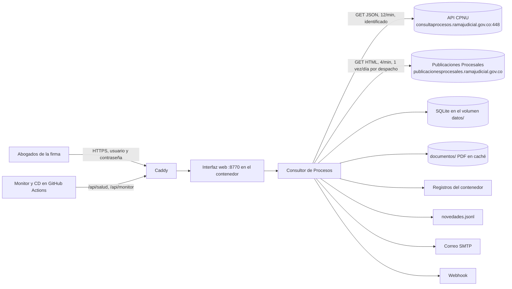
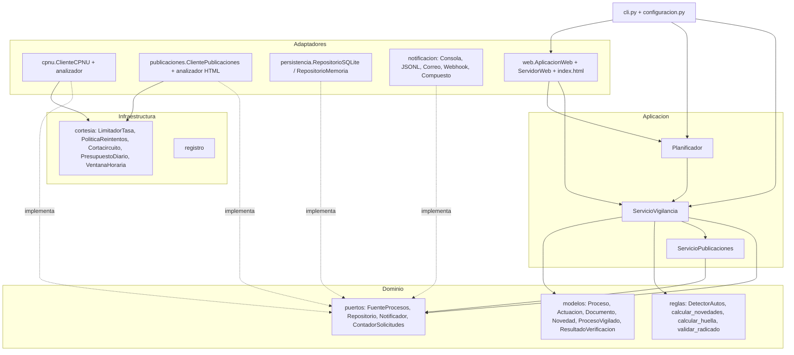
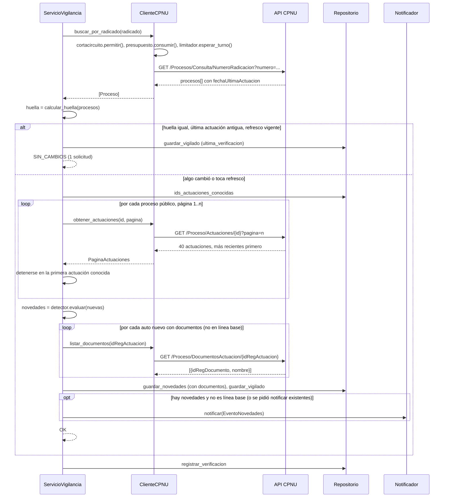
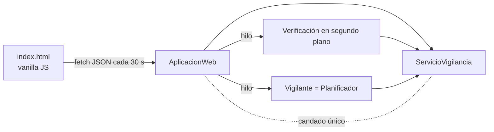

# Arquitectura de Consultor de Procesos

## 1. Objetivo y restricciones

**Objetivo.** Dado un conjunto de números de radicación, saber con la mínima demora razonable
si aparecieron **autos** u otras actuaciones nuevas en la Consulta de Procesos Nacional
Unificada (CPNU) de la Rama Judicial, enlazar el documento del auto cuando exista y avisar.

**Restricciones que gobiernan el diseño.**

1. *No tumbar la página.* El portal es un servicio público compartido; la herramienta debe
   consumir una fracción despreciable de su capacidad.
2. *No ser bloqueado.* Se consigue con lo mismo que el punto 1 más identificación honesta.
   Queda explícitamente fuera cualquier técnica de evasión (rotación de IP, suplantación de
   navegador, resolución de CAPTCHA). La API de la CPNU no tiene CAPTCHA, así que en este
   flujo no hay nada que evadir.
3. *Operable sin intervención.* Corre en un servidor (un contenedor Docker detrás de Caddy),
   se despliega solo desde GitHub y un monitor externo avisa si deja de vigilar bien. Una base
   de datos de un solo archivo; la configuración de cada instalación va en variables de entorno.
4. *Verificable.* Toda la lógica de cortesía y la interfaz deben poder probarse sin dormir ni
   tocar la red.
5. *Fallar en voz alta.* Si la Rama Judicial cambia el formato de sus respuestas, el programa no
   puede seguir con valores por defecto: la verificación queda en `ERROR` y el monitor lo reporta.

## 2. Vista de contexto



El despliegue y la operación (CI, CD, monitor, respaldos) se describen en
[DESPLIEGUE.md](DESPLIEGUE.md).

## 3. Estilo: hexagonal (puertos y adaptadores)

El dominio no conoce HTTP, SQLite, la CLI ni la web. La aplicación orquesta a través de
**puertos** (protocolos de Python) que los **adaptadores** implementan. Cambiar de fuente
(por ejemplo, añadir SAMAI) o de canal de aviso no toca el núcleo.



Dependencias permitidas: `dominio` no importa nada del proyecto; `aplicacion` importa
`dominio`; `adaptadores` importan `dominio`, `aplicacion` (solo la web) e `infraestructura`;
`cli` importa todo. `enlaces.py` (URL del portal y de la API) no depende de nadie.

## 4. Flujo de una verificación



### 4.1 La huella y la política de relectura

La búsqueda por radicado ya trae, por cada despacho donde exista el proceso, la fecha de la
última actuación. La **huella** es la lista ordenada de pares `id_proceso:fecha`. Si no
cambió, casi siempre no hay nada nuevo, y la verificación cuesta una sola solicitud.

"Casi siempre" tiene dos excepciones conocidas, y por eso existen dos válvulas:

- **`dias_gracia` (5).** Dos actuaciones el mismo día no cambian la fecha. Si la última
  actuación es reciente, se releen actuaciones aunque la huella sea igual.
- **`horas_refresco_completo` (24).** Los despachos a veces registran tarde actuaciones con
  fecha anterior (`fechaRegistro` posterior a `fechaActuacion`), lo que no mueve la fecha
  de última actuación. Una relectura de la primera página al menos una vez al día las recoge.

### 4.2 Línea base

La primera lectura de un radicado descarga hasta `max_paginas_inicial` páginas (20 x 40 =
800 actuaciones) y las guarda **sin notificar** y **sin pedir documentos**, salvo
`notificar_existentes = true`. Así, agregar un proceso con años de historia no dispara
cientos de avisos ni de solicitudes.

Las lecturas siguientes paran en la primera actuación ya conocida, que en el caso normal está
en la página 1. El tope es el mismo `max_paginas_inicial`: si entre dos verificaciones llegaron
muchas actuaciones, se sigue leyendo hasta empalmar con lo conocido. (Hasta la versión 0.2 las
lecturas incrementales paraban en 3 páginas: con más de 120 actuaciones nuevas entre dos
verificaciones, las más antiguas de ellas no se leían nunca.) Si ni el tope alcanza, el
resultado lo advierte en su mensaje.

### 4.3 Un radicado, varios despachos

El mismo número de 23 dígitos puede aparecer en primera instancia y en el tribunal de
apelación, con distinto `idProceso`. Se vigilan todos: la huella los incluye, las actuaciones
se leen por cada uno y cada novedad lleva el despacho que la produjo.

## 4.4 Publicaciones procesales (micrositios de los despachos)

Al terminar el lote de radicados, `ServicioPublicaciones.revisar` agrupa los vigilados por
código de despacho (los 12 primeros dígitos del radicado más los descubiertos en la ficha de
detalle durante la línea base) y, por cada despacho revisado hace más de
`horas_entre_revisiones`, pide al portal Publicaciones Procesales los tipos configurados dentro
de la ventana `[última revisión - 1 día, hoy]`. Las publicaciones nuevas se guardan y se
analizan: primero título y resumen; si el listado no trae documentos, la **página de detalle** de
la publicación (muchos juzgados publican allí cada auto como un PDF con el radicado corto en el
nombre, "2025-00451 ...pdf", y dejan vacío el resumen del listado), primero los nombres de los
archivos y luego su texto; y por último los PDF (`pypdf`, con `cryptography` para los cifrados
con AES), empezando por la planilla del estado. Se usan las tres formas del radicado descritas en
`dominio/reglas.py`. La lista se pide a la página "Inicio" del portal, que responde en
`/web/publicaciones-procesales/inicio` y en la raíz `/`: si una da 404 (pasó el 4 de octubre de
2026), el cliente usa la otra y se queda con ella. Cada coincidencia se persiste en
`publicaciones_coincidencias`, se adjunta al resultado del radicado y se notifica como un
`EventoNovedades` sin actuaciones y con `publicaciones`. La revisión falla de forma aislada por
despacho (estado `ERROR`) y, si la fuente cae, el resto del lote queda `OMITIDO`.

## 5. Documentos y el "enlace directo al auto"

El portal es una aplicación de una sola página (Vue) **sin enlaces profundos**: se comprobó
que al abrir el detalle de un proceso la URL sigue siendo `/Procesos/NumeroRadicacion` y que
sus rutas no incluían ningún `Detalle/{id}`. En septiembre de 2026 el portal ya tiene la ruta
`/details-process/{idProceso}`, pero abierta directamente muestra la ficha vacía: el componente
lee el proceso del estado de la aplicación, que solo se llena tras una búsqueda en la misma
sesión, y no consulta la API con el id de la URL. Por tanto sigue sin existir una URL oficial
que apunte a un proceso o a un auto. La herramienta ofrece, en su lugar:

1. **Su propia vista** de la actuación (`/api/novedades/{idRegActuacion}` y el diálogo de la interfaz) y la
   **página visor** `/documento/{idRegActuacion}[/{idRegDocumento}]`, que abre el PDF a pantalla completa con
   el texto de la actuación, la descarga oficial y el portal (es el botón «Abrir auto»).
2. **El PDF publicado por el despacho.** La API expone `GET /Proceso/DocumentosActuacion/{idRegActuacion}`
   (lista con `idRegDocumento` y `nombre`) y `GET /Descarga/DocumentoActuacion/{idRegDocumento}`
   (el archivo). El servicio lista los documentos de cada auto nuevo, los guarda y los enlaza en
   todas las notificaciones; la interfaz los previsualiza en un `iframe` servido por el propio
   servidor local (`/api/documentos/{id}`), que descarga una sola vez y guarda en
   `general.directorio_documentos`.
3. **El botón "Portal"**, que copia el radicado al portapapeles y abre la página oficial de consulta.

Las descargas pasan por la misma política de cortesía que cualquier otra solicitud y se sirven
desde la caché en disco en las siguientes visualizaciones.

## 6. Política de cortesía (infraestructura/cortesia.py)

Orden de comprobación en cada solicitud, dentro de `SolicitanteCortes.get`
(`infraestructura/http_cortes.py`, compartido por la CPNU y Publicaciones Procesales):

1. **Cortacircuito** `permitir()`. Si está abierto, se lanza `CircuitoAbierto` sin tocar la red.
2. **Presupuesto diario** `consumir()`. Si se alcanzó el tope, `PresupuestoAgotado`.
3. **Limitador de tasa** `esperar_turno()`. Cubeta de fichas: `solicitudes_por_minuto` sostenidas, `rafaga` inmediatas.
4. **HTTP GET** con `User-Agent` propio (forzado a ASCII), `Accept: application/json`, tiempo de espera de 20 s.
5. Según la respuesta:
   - `2xx` -> éxito, el cortacircuito se cierra.
   - `4xx` distinto de 408/425/429 -> `ErrorFuente` definitivo, sin reintento. Para el
     cortacircuito cuenta como respuesta sana (la fuente funciona; el problema es la petición),
     salvo 401 y 403, que pueden ser un bloqueo y cuentan como fallo.
   - `429`, `5xx`, tiempo de espera, error de conexión -> fallo transitorio: cuenta para el
     cortacircuito y se reintenta con espera `min(base * factor^(n-1), maximo) * U(0.5, 1)`,
     salvo que venga `Retry-After`, que se respeta tal cual (y si pide más de
     `retry_after_maximo`, se desiste).
6. Agotados los intentos -> `FuenteNoDisponible`. `ServicioVigilancia.verificar_todos`
   marca el resto del lote como `OMITIDO` en lugar de seguir insistiendo.

Toda solicitud que el cortacircuito deja pasar le informa el resultado: éxito, fallo o, si
salió por una excepción antes de saber nada de la fuente (por ejemplo el presupuesto agotado),
`liberar_sonda()`. Además, una sonda del estado SEMIABIERTO que no se resolviera vence tras
`segundos_abierto`. (Hasta la versión 0.2, una sonda que recibía un 4xx dejaba el circuito
bloqueado hasta reiniciar el programa.)

El presupuesto diario se descuenta con una sola operación atómica del contador
(`incrementar_si_menor`: en SQLite, un `INSERT ... ON CONFLICT DO UPDATE ... WHERE cantidad < ?`),
así que ni varios hilos ni varios procesos sobre la misma base pueden pasarse del tope.

Además del cliente, el **Planificador** (`aplicacion/planificador.py`) decide *cuándo* se
verifica. Su modo predeterminado es por **horario** (`aplicacion/horario.py`): horas fijas en
días hábiles (lunes a viernes a las 07:00, 10:00, 13:00 y 17:00) con una fluctuación de hasta
5 minutos, sin ejecutar nada después de `hasta` (18:00), ni en fines de semana o festivos
configurados. Al arrancar, si dentro de la jornada ya pasó una hora programada que no llegó a
ejecutarse (según la bitácora de verificaciones), se ejecuta de inmediato; si el equipo
despierta de una suspensión fuera de la jornada, se reprograma. El modo por **intervalo**
(`horas = []`) conserva la fluctuación de +/- 20 % y la ventana horaria de `[cortesia]`. El
servicio hace una **pausa** entre radicados; y la interfaz web serializa con un **candado
único** toda operación hacia la fuente.

Todos estos componentes reciben `reloj` y `dormir` por inyección. En pruebas se usa un reloj
falso cuyo `dormir` avanza el tiempo, así que la suite completa corre en pocos segundos. La
espera del planificador es un `Event.wait`, de modo que `detener()` despierta el bucle de
inmediato (necesario para apagar la vigilancia desde la interfaz).

## 7. Interfaz web (adaptadores/web)



- **`AplicacionWeb`** contiene los endpoints como funciones sobre `(método, ruta, consulta, cuerpo)`
  y devuelve `(estado, contenido, tipo, cabeceras)`. Se prueba sin abrir puertos.
- **`ServidorWeb`** es el transporte: `ThreadingHTTPServer` de la biblioteca estándar en un hilo.
  Escucha en `127.0.0.1` por defecto; en el contenedor, en `0.0.0.0:8770` detrás de Caddy
  (`--proxy`: la IP del cliente sale de `X-Forwarded-For`). `docker stop` (SIGTERM) se atiende
  como Ctrl+C: detiene la vigilancia y el servidor en orden.
- **Verificación en segundo plano.** `POST /api/verificar` toma el candado de la fuente, lanza un
  hilo y responde 202; la página consulta `/api/estado` cada 3 s mientras dura y muestra el resumen
  al terminar. Si el candado está tomado, responde 409 en lugar de encolar trabajo.
- **Vigilante.** Envuelve un `Planificador` en un hilo; `POST /api/vigilante/iniciar|detener`. Con
  `vigilancia.iniciar_con_interfaz = true` (predeterminado) arranca junto con el servidor.
- **Dos niveles.** `GET /api/estado` alimenta las tarjetas de procesos (nivel 1, con la ficha
  guardada en `procesos_vigilados`); `GET /api/procesos/{radicado}` entrega el nivel 2: ficha,
  historial completo, coincidencias en publicaciones y bitácora. La página es una sola (`#/procesos`,
  `#/proceso/{radicado}`, `#/novedades`).
- **Seguridad** (`adaptadores/web/seguridad.py`). `AplicacionWeb.autorizar` se aplica antes de
  despachar cualquier ruta, salvo `GET /api/salud`:
  - Usuarios de `CONSULTOR_USUARIOS` (hash scrypt con sal) y autenticación HTTP Basic sobre
    HTTPS. Una credencial validada se recuerda 10 minutos por su huella SHA-256 para no pagar
    scrypt en cada petición. Tras 10 fallos seguidos, la IP queda bloqueada 15 minutos (429).
  - CSRF: `POST`/`DELETE` exigen `X-Requested-With: XMLHttpRequest`; la API rechaza lo que el
    navegador marca `Sec-Fetch-Site: cross-site`.
  - Cabeceras: `nosniff`, `X-Frame-Options`, `Referrer-Policy`, CSP en las páginas HTML,
    `Cache-Control: no-store` en la API. Cuerpos de más de 64 KB: 413.
  - Sin usuarios, el servidor se niega a escuchar fuera de `127.0.0.1` (salvo `--sin-autenticacion`,
    pensado para una red interna como el futuro acoplamiento con el Administrador).
- **Salud y monitoreo.** `GET /api/salud` (pública) responde versión y commit si la base se puede
  leer; la usan el `HEALTHCHECK` de Docker y el despliegue. `GET /api/monitor` (con usuario)
  resume si la vigilancia está sana: `ok` es falso si la vigilancia está detenida, si una hora
  programada no se ejecutó (con 45 minutos de tolerancia, contando solo desde que arrancó), si la
  última verificación de algún proceso quedó en `ERROR` o si falló la de publicaciones.

| Método y ruta | Función |
| --- | --- |
| `GET /` | Página de la interfaz |
| `GET /api/salud` | Pública: `{"estado", "version", "commit"}`; 503 si la base no responde |
| `GET /api/monitor` | Estado de la vigilancia para el monitor: `ok`, `problemas`, `avisos`, última verificación, presupuesto, cortacircuito |
| `GET /api/estado` | Procesos con su ficha y pendientes, vigilante y horario, verificación en curso, presupuesto, fuente |
| `GET/POST /api/vigilados`, `DELETE /api/vigilados/{radicado}` | Gestión de radicados |
| `GET /api/procesos/{radicado}?limite`, `POST /api/procesos/{radicado}/alias` | Ficha con historial completo (nivel 2); cambio de nombre |
| `GET /documento/{idRegActuacion}[/{idRegDocumento}]` | Página visor del auto: PDF a pantalla completa con enlaces a la fuente |
| `POST /api/verificar`, `GET /api/verificar/estado` | Verificación en segundo plano |
| `GET /api/novedades?solo_autos&pendientes&radicado&limite` | Panel de novedades |
| `GET /api/novedades/{id}`, `POST .../revisada`, `GET .../documentos?forzar` | Detalle, revisadas, documentos |
| `GET /api/documentos/{id}?descargar` | PDF en línea (previsualización) o como descarga |
| `GET /api/consultar/{radicado}?max_paginas&sin_detalle` | Consulta puntual sin persistir |
| `GET /api/historial?radicado&limite` | Bitácora de verificaciones |
| `POST /api/vigilante/iniciar`, `POST /api/vigilante/detener` | Vigilancia periódica |

## 8. Modelo de datos (SQLite)

| Tabla | Clave | Contenido |
| --- | --- | --- |
| `procesos_vigilados` | `radicado` | alias, `id_proceso` principal, `huella`, fecha de última actuación, última verificación, última lectura de actuaciones, `inicializado`, `activo`, `creado_en`, `despachos` (códigos para publicaciones) y la ficha: `despacho`, `departamento`, `sujetos`, `tipo_proceso`, `clase_proceso`, `ponente`, `fecha_proceso` |
| `actuaciones_vistas` | `id_registro` (el `idRegActuacion` de la API, único a nivel nacional) | radicado, `id_proceso`, consecutivo, tipo, anotación, fechas, `con_documentos`, `es_auto`, `coincidencias`, despacho, `visto_en`, `revisada`, `documentos_consultados_en` |
| `documentos` | `id_documento` (`idRegDocumento`) | `id_registro`, nombre, fecha, tipo, tamaño, `ruta_local`, `descargado_en`, `registrado_en` |
| `publicaciones` | `id_publicacion` (`articleId` del portal) | despacho, tipo, título, fecha, enlace, resumen, documentos (JSON), categorías, `analizada`, `visto_en` |
| `publicaciones_coincidencias` | autoincremental, única por (publicación, radicado, lugar) | radicado, forma, dónde apareció, fragmento, `visto_en`, `revisada` |
| `revisiones_despacho` | `despacho_codigo` | última revisión de publicaciones de ese despacho |
| `verificaciones` | autoincremental | bitácora: radicado, momento, estado, novedades, autos, solicitudes, mensaje |
| `contadores_solicitudes` | `fecha` | solicitudes realizadas ese día (respalda el presupuesto diario) |

Se usa `sqlite3` de la biblioteca estándar en modo WAL, sin ORM. Las columnas añadidas después
de la primera versión se crean con `ALTER TABLE` al abrir bases antiguas. Un candado reentrante
serializa el acceso porque la interfaz web comparte la conexión entre hilos.
`RepositorioMemoria` implementa el mismo puerto y se prueba con la misma batería parametrizada.

Los contadores de pendientes por proceso que la interfaz pide cada 30 segundos se calculan con
un `GROUP BY` en la base, y las coincidencias de publicaciones se cargan con una sola consulta
para todas sus publicaciones. `respaldar()` usa la API de respaldo de SQLite, segura con el
servidor en marcha; la usa el comando `respaldar` y el despliegue antes de cada actualización.

## 9. Detección de autos (dominio/reglas.py)

```text
texto = normalizar(actuacion) + " | " + normalizar(anotacion)
es_auto = \bAUTO(S|ES)?\b coincide en texto      (para cada palabra clave configurada)
```

`normalizar` descompone Unicode (NFKD), elimina diacríticos, colapsa espacios y pasa a
mayúsculas. La coincidencia por palabra completa evita falsos positivos ("AUTOMOTOR",
"AUTORIZA") y acepta plurales y guiones ("AUTOS", "AUTO-ADMISORIO"). Las palabras clave son
configurables (`verificacion.palabras_clave`).

Se evalúa siempre la anotación porque, en datos reales, los autos aparecen con frecuencia
bajo el tipo "Constancia secretarial" y solo la anotación dice "AUTO ORDENA REQUERIR...".

## 10. Manejo de errores

| Situación | Excepción | Comportamiento |
| --- | --- | --- |
| Radicado mal formado | `RadicadoInvalido` | Se rechaza localmente antes de consultar; la web responde 400 |
| 4xx definitivo, JSON inválido | `ErrorFuente` | El radicado queda en `ERROR`; el lote continúa; la web responde 502 |
| Falta o cambió de nombre una clave de la respuesta (`idRegActuacion`, `procesos`, `paginacion`...), o el portal de publicaciones anuncia resultados que no se reconocen | `RespuestaInesperada` (subclase de `ErrorFuente`) | Igual que la anterior, y además no se tolera al leer la ficha ni los documentos: el radicado queda en `ERROR`, nada se guarda a medias y el monitor abre un issue |
| 429 / 5xx / red, reintentos agotados | `FuenteNoDisponible` | El radicado y el resto del lote quedan `OMITIDO`; la web responde 503 |
| Cortacircuito abierto | `CircuitoAbierto` (subclase de la anterior) | Igual que la anterior, sin tocar la red |
| Tope diario | `PresupuestoAgotado` | Igual: se pospone el lote |
| Fallo al listar documentos de un auto | `ErrorFuente` capturado | El auto se registra sin documentos; se pueden pedir después desde la interfaz |
| Documento no registrado | `DocumentoNoEncontrado` | La web responde 404; no se hace *proxy* de identificadores arbitrarios |
| Otra operación hacia la fuente en curso | `Ocupado` (409) | La interfaz invita a reintentar en unos segundos |
| Radicado inexistente en la fuente | estado `NO_ENCONTRADO` | Se registra; no es un error |
| Proceso privado | estado `PRIVADO` | Se registra; no se piden actuaciones |
| Un notificador falla | capturado por `NotificadorCompuesto` | Se registra en el log; los demás canales siguen |

Códigos de salida de la CLI: 0 correcto, 1 error de uso o configuración, 2 fuente no
disponible o presupuesto agotado, 3 no encontrado.

## 11. Extensibilidad

- **Nueva fuente** (SAMAI, TYBA si algún día ofrece una vía sin CAPTCHA, estados electrónicos
  de un despacho): implementar `FuenteProcesos` devolviendo los modelos del dominio y reutilizar
  la misma política de cortesía. Nada más cambia.
- **Nuevo canal de aviso**: implementar `Notificador.notificar(EventoNovedades)` y añadirlo
  en `cli.construir_notificador`. Los ayudantes de `notificacion/formato.py` dan texto y JSON listos.
- **Nueva regla de detección**: `DetectorAutos` recibe palabras clave; para reglas más ricas
  basta con envolverlo o sustituirlo, ya que el servicio solo depende de `evaluar(actuacion, despacho) -> Novedad`.
- **Nuevo endpoint web**: añadir una tupla `(método, patrón, manejador)` en `AplicacionWeb._rutas`.

## 12. Decisiones y alternativas descartadas

| Decisión | Alternativa | Por qué |
| --- | --- | --- |
| Cliente **sincrónico** | `asyncio` + `httpx.AsyncClient` | La cortesía impone una solicitud a la vez; la concurrencia no aporta y complica pruebas y operación |
| `dataclasses` de la biblioteca estándar | `pydantic` | Menos dependencias; el traductor (`analizador.py`) exige las claves de las que depende y valida lo que importa |
| `argparse` y `http.server` | `typer`, FastAPI/Flask | Cero dependencias nuevas; el número de comandos y endpoints es pequeño y los usuarios son pocos |
| HTTP Basic con usuarios en una variable de entorno | Sesiones con cookie y tabla de usuarios | Pocos usuarios, sin pantallas de administración que mantener; sobre HTTPS es seguro. El Administrador de Procesos, que sí gestiona usuarios y roles, usa sesiones |
| Monitor en GitHub Actions | Uptime Kuma, Healthchecks.io | Nada que instalar ni pagar; las alertas llegan como issues que quedan como historial |
| Página única en JavaScript puro | React/Vue + herramienta de construcción | Un archivo que se sirve tal cual; nada que compilar ni instalar |
| SQLite sin ORM | SQLAlchemy, JSON plano | Un archivo, transacciones, consultas simples; JSON no escala al historial |
| API JSON del portal | *scraping* del HTML / navegador automatizado | Es lo que el propio portal consume; más ligero para el servidor y para el cliente |
| Huella + relectura periódica | Releer siempre la página 1 | Reduce las solicitudes a 1 por radicado en el caso común sin perder actuaciones tardías |
| Documentos solo para autos nuevos | Listar documentos de todas las actuaciones | Una solicitud extra solo donde aporta valor; el resto se pide a demanda |
| Sin evasión de bloqueos | Proxies, agentes de navegador, resolución de CAPTCHA | Contraria al objetivo y a las condiciones de uso del portal; a largo plazo garantiza el bloqueo |

## 13. Estrategia de pruebas

```text
tests/test_reglas.py                  detector, huella, novedades, validación de radicado
tests/test_cortesia.py                limitador, reintentos, Retry-After, cortacircuito, presupuesto, ventana
tests/test_analizador.py              traducción de las formas reales de la API (anonimizadas)
tests/test_cliente_cpnu.py            cliente HTTP con respx: cabeceras, 404, 429+Retry-After, 503, timeouts, circuito, presupuesto
tests/test_repositorios.py            SQLite y memoria con la misma batería; persistencia al reabrir
tests/test_novedades_y_documentos.py  documentos (analizador, cliente, repositorios, caché en disco), pendientes/revisadas, migración de esquema
tests/test_servicio_vigilancia.py     línea base, SIN_CAMBIOS, relecturas, autos nuevos, dos despachos, estados, lote detenido
tests/test_planificador.py            modo por intervalo: ciclos, fluctuación, ventana horaria, resiliencia, parada inmediata
tests/test_horario.py                 horario: horas, días, festivos, fin de jornada, recuperación al arrancar, planificador por horario
tests/test_notificadores.py           formato, consola, JSONL, correo (transporte inyectado), webhook (respx), compuesto
tests/test_configuracion.py           valores por defecto, TOML parcial, plantilla generada
tests/test_cli.py                     extremo a extremo con fuente falsa y base temporal; salida UTF-8
tests/test_web.py                     todos los endpoints sin puertos + servidor HTTP real en un puerto libre
tests/test_web_seguridad.py           usuarios y hash, 401/429, CSRF y origen, cabeceras, proxy, /api/salud y /api/monitor
tests/test_publicaciones.py           analizador HTML del portal, patrones de radicado, PDF, cliente, repositorios, servicio e integración
tests/test_en_vivo.py                 opcional: tres solicitudes reales (variables de entorno)
```

Fuera de `tests/`, la CI construye la imagen, la arranca con un usuario de prueba y la revisa con
`scripts/vigilar.py`, el mismo script que usan el CD y el monitor.

Los datos de prueba replican la forma exacta observada en la API (nombres de campos,
espacios finales, `null`, 40 por página, orden descendente) pero con contenido ficticio.

## 14. Referencia de la API observada (septiembre de 2026)

Base: `https://consultaprocesos.ramajudicial.gov.co:448/api/v2`

| Recurso | Método y ruta | Notas |
| --- | --- | --- |
| Búsqueda por radicado | `GET /Procesos/Consulta/NumeroRadicacion?numero={23 dígitos}&SoloActivos=false&pagina=1` | 200 con `procesos: []` si no existe; 404 con `{"StatusCode":404,"Message":"..."}` si el número no tiene 23 dígitos |
| Detalle | `GET /Proceso/Detalle/{idProceso}` | `idRegProceso` del cuerpo **no** es el `idProceso`; se conserva el de la búsqueda |
| Actuaciones | `GET /Proceso/Actuaciones/{idProceso}?pagina=n` | 40 por página, `consActuacion` descendente; `paginacion.cantidadPaginas` |
| Documentos de una actuación | `GET /Proceso/DocumentosActuacion/{idRegActuacion}` | Lista (`[]` si no hay) con `idRegDocumento` y `nombre` |
| Descarga de un documento | `GET /Descarga/DocumentoActuacion/{idRegDocumento}` | El archivo; el portal lo nombra con el `nombre` de la lista |
| Portal (sin enlaces profundos) | `https://consultaprocesos.ramajudicial.gov.co/Procesos/NumeroRadicacion` | El detalle se abre en la misma URL |
| Publicaciones Procesales | `GET publicacionesprocesales.ramajudicial.gov.co/web/publicaciones-procesales/inicio?...idStructure&idDespacho&fechaInicio&fechaFin&delta&cur` | HTML de ~1 MB por página; detalle en `docs/FUENTES.md` |

Campos relevantes de una actuación: `idRegActuacion` (clave única), `consActuacion`,
`fechaActuacion`, `fechaRegistro`, `actuacion`, `anotacion`, `conDocumentos`. El servidor es
IIS y no expone cabeceras de límite de tasa, de ahí que los límites sean autoimpuestos.
